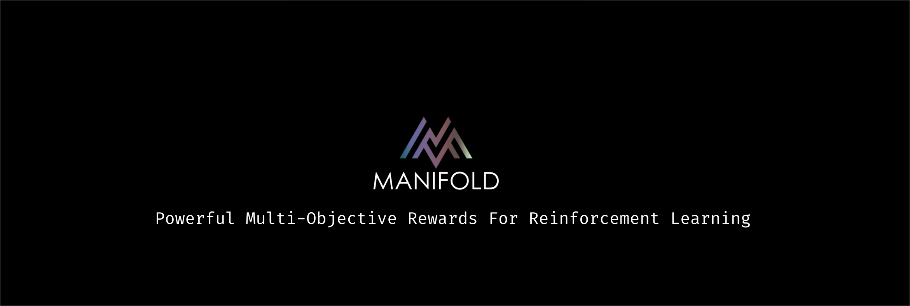

# Manifold: Effectively Create Powerful Rewards For Reinforcement Learning




---

`Manifold` is an open source Python framework for generating, experimenting, and deploying robust reward algorithms for reinforcement learning. The framework focuses on being highly composable and extensible, to create complex strategies that work on a single agent on one machine, to allow for creating multiple reward strategies for entire fleets of algorithms.

We do this by focusing on using two major topics from complex geometry, optimization and dynamical systems: 

1. `Manifolds` - Defined complex geometric spaces that resemble euclidian spaces. We use this to create a map of where we want to let the RL agent evolve.
2. `Attractors` - A set of numerical values toward which a system tends to evolve, for a wide variety of starting conditions of the system.
3. `Multi-Objective Scalarization` - A way to turn a `multi-objective` problems into a single number. This single number will allow us to feed information into the RL algorithm to optimize to. We can set rules of how scalarization will play out over time.


## Design Philosophy

Comment about `keras` design philosophy ... Need to go into details. 

For further information, please refer to the [design doc](docs/design.md) and the some more [conceptual details](docs/concept.md) here.


## Installation Instructions

```
pip install manifold-ml
```