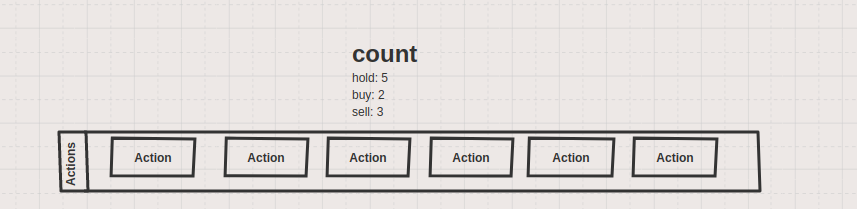
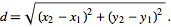
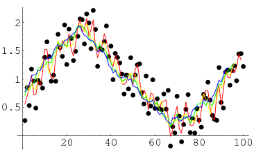

# Core Concept

We're going to run through the core concepts of the library here in bullet point form first:

* The end result for the library is to produce a single number for multiple objectives
* To do that we use something called ordering cones. It's a simple idea, we create a rule set to order a set of numbers, then rank the numbers tied to those numbers from 0-1.
  * The combined total should be 1 at the end.
* We define objectives based on memory of how an environment has played out over time. We give a variable a score based on how a variable has moved over time.
* Once we assign a score for the given variables we're watching, we create an aggregate number `scalarization` based on the percentage of the total we assign each variable.

## A Practical Example: Building the Perfect Trading Bot 

This may seem confusing, so lets run through a practical example with a trading bot. Trading has lots of objectives that they can take on, but we're going to start with two:

1. We want to have a limited number of big trades (things that are buy/sell, yet not hold)
2. We also want to be profitable consistently

If you think 1 reward is rough, now we can see that having two can be rough. What we're going to do is run through creation of a two part reward that balances both of these.

### Action Control

Lets say, over a 10 hour period, we want to make sure the bot only makes 3 active trades (buy/sell), and force the rest to be hold.

This means, given a historical account of all possible moments we could make an action, reward the action as it gets closer to the ideal state (3/10 possible actions).

In other words, the way we do this is rather simple. We use something called rolling logic and get the distance from an ideal state at each step. When handling simple spaces we use simple euclidian distance. As this library evolves, and as we're better able to define manifolds, we'll use geodesics to determine if the machine is heading towards an ideal state on a given curvature.

1. At each step we're getting the `rolling_count`. That's looking at the history of the actions, and getting the count of each kind of action (for discrete action spaces.)
2. We then compare the distance of each `rolling_count` in an aggregate list and get the distance from the ideal state we set (3/10).
3. A distance of 0 usually entails that we're exactly on an ideal state, and that we should reward accordingly.
4. An absolute value of anything greater than 0 entails we're not in an ideal state.
5. Once we have a distance for each step, we can get both the **trend**, and **percentage change** over a second window.

Using just the following end variables we can now determine a reward for this specific variable:

1. Distance from ideal state
2. Trajectory towards or from ideal state
3. Overall speed + momentum towards ideal state

After running a quick algebreic expression using those 3 scaler values, we can create a single number representing how much the RL agent just conformed to an ideal state. Not only that, we can get a feel of how the agent has conformed to an ideal state over time. That's because the rolling properties of the equation are **autoregressive** meaning the present state encodes many prior states. This concept is also seen with statistical moving averages.

### Combining Rewards

Let's skip the profitability for now. Lets say we have two complete numbers: 100 and 45, representing profitability and action coherence. Now we need to generate a single number representing the reward. We can simply weigh each reward then summarize them. Let's add the following weights for profitability and action coherence:

1. profitability - 70%
2. action_coherence - 30%

The maximum score for both variables is 150, which we'd usually for each variable observed.

From here, we simply multiply each variable by their associated percentage 70/30, then sum the two numbers.

1. profitability - (100 * 0.70) = 70
2. action_coherence - (100 * 0.30) = 30

The combined total of those two numbers is 100/150. Remember that 150 is the cap for all variables in this problem. We could then reward the reinforcement learning algorithm a single number it can try to maximize.

I'm sure there are some questions of how to generate these weights, or perhaps how to adaptively scale the cap of each variable. We'll figure that out over time. At the same time, this is a calm overview of what this library aims to achieve. A means of creating powerful multi-objective rewards like what was just mentioned.